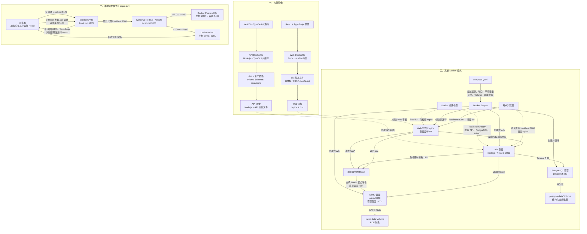

# Docker、Nginx、Web 与 API 关系图

这份图只说明当前学习项目，不代表所有公司的部署结构都完全相同。

## 总览图



## 1. 先区分构建和运行

### Web 构建

```text
React + TypeScript 源码
        ↓ Node.js 构建阶段执行 tsc 和 vite build
静态 dist：index.html、JavaScript、CSS
        ↓ 复制进最终镜像
Nginx + dist
```

Node.js 在这里负责构建，但生产 Web 容器不需要 Node.js。浏览器负责执行构建后的 JavaScript，Nginx 只负责传输文件和代理请求。

### API 构建

```text
NestJS + TypeScript 源码
        ↓ Node.js 构建阶段执行 TypeScript 编译
服务端 JavaScript dist
        ↓ 与生产依赖、Prisma 文件一起复制
Node.js API 运行镜像
```

API 的 `dist` 仍是服务端程序，需要 Node.js 持续执行、监听 3000、处理请求，因此最终 API 镜像必须包含 Node.js。

## 2. 完整 Docker 运行结构

```text
Windows / 用户浏览器
        |
        | http://localhost:8080
        v
+--------------------------------------+
| Web 容器                             |
| Nginx 监听 80                        |
|                                      |
| /、/assets     → 返回 React 静态文件 |
| /前端路由      → 返回 index.html     |
| /api/*         → 反向代理            |
| /healthz       → 直接返回 200        |
+------------------+-------------------+
                   |
                   | http://api:3000/api/*
                   v
+--------------------------------------+
| API 容器                             |
| Node.js 运行 NestJS，监听 3000       |
|                                      |
| Controller → Guard/Pipe → Service    |
+-----------+----------------+---------+
            |                |
            | postgres:5432  | minio:9000
            v                v
+-------------------+  +-------------------+
| PostgreSQL 容器   |  | MinIO 容器       |
| 结构化业务数据    |  | PDF 对象内容      |
| postgres-data     |  | minio-data        |
+-------------------+  +-------------------+
```

容器间通过 Compose 网络和服务名通信：`api`、`postgres`、`minio`。浏览器通过主机端口或正式域名访问，不能把容器服务名当成公共域名。

## 3. 各部分负责什么

| 部分 | 当前职责 | 不负责什么 |
| --- | --- | --- |
| Docker Engine | 创建和运行镜像、容器、网络、Volume | 不判断评分业务是否正确 |
| Dockerfile | 描述如何制作一个镜像 | 不管理多个运行中服务 |
| Docker Compose | 描述多个服务、端口、环境变量、依赖、健康检查和 Volume | 不编写 React/NestJS 业务逻辑 |
| React Web | 页面、交互、请求发起和结果展示 | 不可信地决定用户身份或直接写数据库 |
| Nginx | 返回 Web 静态文件、代理 `/api`、SPA fallback、Web 健康检查 | 不执行 NestJS Service，不查询数据库 |
| NestJS API | 身份权限、参数校验、业务规则、数据库和文件协调 | 不替代浏览器渲染 React |
| PostgreSQL | 用户、评审项、评分、文件元数据等结构化数据 | 不保存当前方案中的 PDF 字节 |
| MinIO | 保存 PDF 对象并生成/校验对象访问能力 | 不保存评分业务规则 |

## 4. Compose 在哪里连接这些部分

```text
image / build     → 每个容器使用哪个镜像、如何构建
ports             → 主机端口如何进入容器
environment       → API 如何得到数据库、MinIO、JWT 等配置
depends_on        → 首次启动时等待必要依赖 healthy
healthcheck       → Docker 如何判断当前容器健康状态
volumes           → PostgreSQL 和 MinIO 数据如何独立于容器保存
```

Compose 是运行关系说明，不代替 Dockerfile。Dockerfile 是单个镜像制作说明，不代替 Compose。

## 5. 三种真实请求如何流动

### 打开页面

```text
浏览器 GET /
→ 主机 8080
→ Web 容器 Nginx 80
→ /usr/share/nginx/html/index.html
→ 浏览器加载并执行 React JavaScript
```

### 保存评分

```text
React PUT /api/review-items/.../score
→ Nginx /api 反向代理
→ NestJS Controller
→ JWT/角色/DTO/Service 校验
→ Prisma
→ PostgreSQL
→ 响应沿原路返回 React
```

### 预览 PDF

```text
React GET /api/documents/:id/preview-url
→ Nginx
→ NestJS 查询 PostgreSQL 文件元数据
→ NestJS 请求 MinIO 生成临时签名 URL
→ URL 返回浏览器
→ 浏览器通过签名 URL直接请求 MinIO 9000
```

当前“临时 URL 预览”最后一步通常不再经过 NestJS；生产环境可能再通过统一域名的 Nginx 代理 MinIO，但权限和过期签名仍要由后端控制。

## 6. 三类端口不要混淆

```text
程序监听端口：nginx.conf 的 listen 80、NestJS 的 PORT=3000
镜像说明端口：Dockerfile 的 EXPOSE 80/3000
主机发布端口：Compose 的 8080:80、3000:3000
```

决定请求能否到达的主要是“程序确实监听目标端口”和“主机映射到同一个容器端口”。`EXPOSE` 只提供镜像元数据，但仍应与真实监听端口一致。

## 7. 健康检查的边界

```text
Web /healthz
→ 只证明 Nginx 能响应

API /api/health/live
→ 只证明 NestJS 进程能响应

API /api/health/ready
→ 检查 PostgreSQL 和 MinIO 是否可供当前 API 使用
```

`depends_on` 只控制首次启动顺序。依赖在运行期间故障，不会自动停止其他容器；监控发现问题后，应根据原因决定恢复动作。

## 8. 开发模式为什么不同

日常 `pnpm dev`：

```text
Windows Vite 5173
Windows NestJS 3000
Docker PostgreSQL 5432
Docker MinIO 9000/9001
```

“浏览器”和“浏览器中的 React”不是两个独立服务。Vite 先把 HTML/JavaScript 返回给浏览器，浏览器加载后开始运行 React；随后 React 发出的相对地址 `/api` 请求会先到同源的 Vite 5173，再由 Vite 开发代理转发到 NestJS 3000。

完整 Docker 模式：

```text
Docker Web：主机 8080 → 容器 Nginx 80
Docker API：主机 3000 → 容器 Node.js 3000
Docker PostgreSQL
Docker MinIO
```

Windows NestJS 和 Docker API 都默认占用主机 3000，不能同时运行。开发时能访问 5173，不代表 Docker Web 容器正在运行。

## 9. AI 开发需要掌握的判断

不需要默写 Dockerfile、Compose 或 Nginx 语法，但必须能够确认：

- 当前运行的是本机开发服务还是 Docker 容器。
- 请求经过哪个主机端口、容器和应用。
- `/api` 是否被代理到正确服务名和端口。
- 数据保存于 PostgreSQL、MinIO 还是 Volume。
- 健康检查覆盖了哪一层，不能证明哪些功能。
- 最终镜像是否意外包含源码、开发依赖、密钥或 `.env`。
- 迁移失败、依赖停止、端口冲突时分别会出现什么现象。
